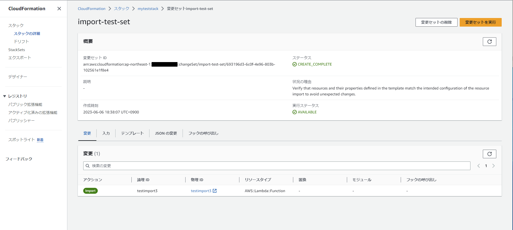
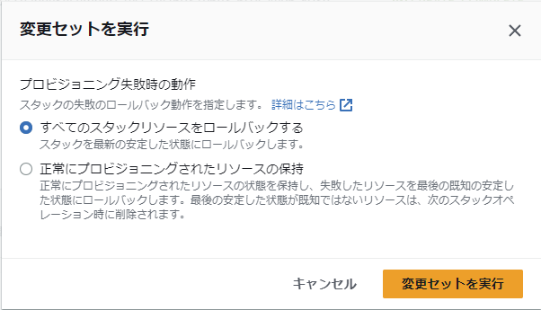
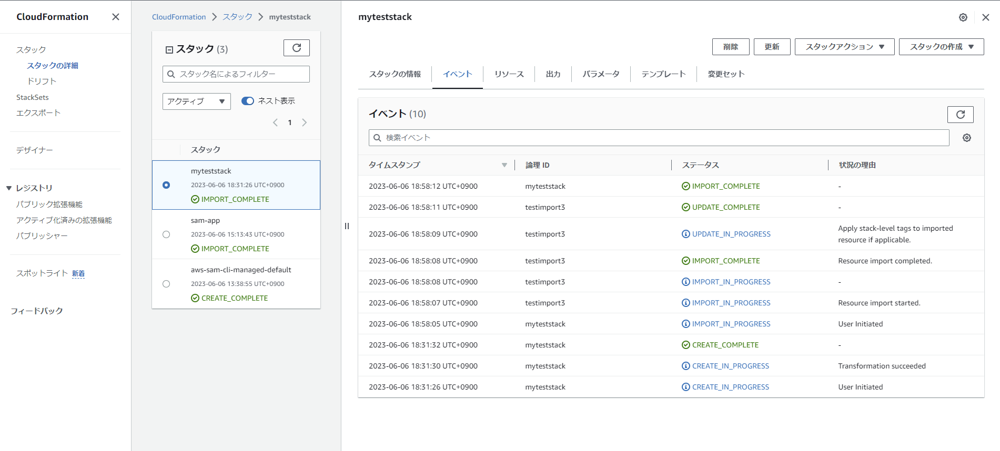
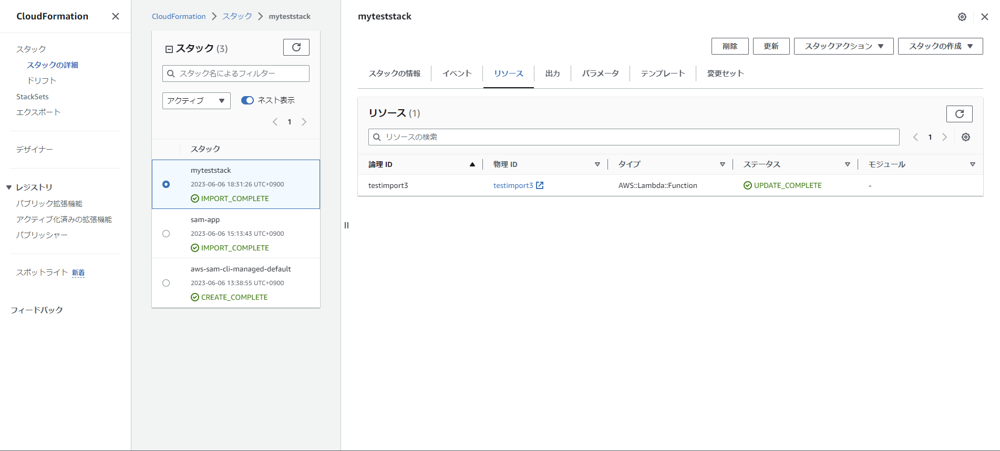
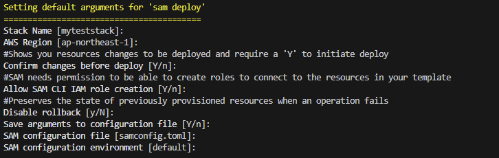
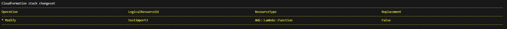

# 1. importing existing lambda into cloudformation

## 1. create cloudformation stack
input
```PowerShell
aws cloudformation create-stack `
  --stack-name myteststack `
  --template-body file://1_template_emptystack.yaml `
  --capabilities CAPABILITY_AUTO_EXPAND
```
output
```
{
    "StackId": "arn:aws:cloudformation:ap-northeast-1:000000000000:stack/myteststack/324f5d10-0454-11ee-bc00-0604b3c40ae5"
}
```

## 2. modify import

2_import.txt LogicalResourceId,ResourceIdentifier

2_template_import.yaml Logical ID,FunctionName

## 3. create change set

input
```PowerShell
aws cloudformation create-change-set `
    --stack-name myteststack `
    --change-set-name import-test-set `
    --resources-to-import file://2_import.txt `
    --change-set-type IMPORT `
    --template-body file://2_template_import.yaml `
    --capabilities CAPABILITY_IAM
```

## 4. import resource





## 5. edit template.yaml
copy & paste expoert lambda sam file
add DeletionPolicy
add propaty FunctionName
replace CodeUri

## 6. associate cloudformation stack with sam
```PowerShell
sam build
sam deploy --guided
```

match the stack name to the created name.



check if replacement in changeset is false.



update complete.


## 7. resource update (optional)
```PowerShell
sam build
sam deploy --guided
```